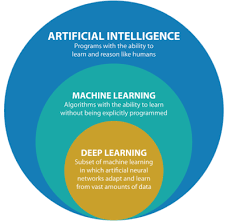

# ML-AI-DL-Guide
Some beginner guide to Machine Learning, Artificial Language and Deep Learning Neural Networks by **Bishal Giri**

## Table of Contents
- [ML-AI-DL-Guide](#ml-ai-dl-guide)
  - [Table of Contents](#table-of-contents)
  - [Machine Learning/ ML](#machine-learning-ml)
  - [Artificial Intelligence](#artificial-intelligence)
  - [Neural Networks](#neural-networks)
  - [TensorFlow](#tensorflow)




## Machine Learning/ ML
```python
Classical Programming:
#Data -->
        #Answers
#Rules --> 

Machine Learning:
#Data --->
          #Rules
#Answers --> 
```
- Rather than giving the program the rules, the algorithm finds the rules for us. 
- Requires lot of data (very important) to train the model. 
- **Feature** in ml is a property shared by all the independent units on which you want to apply the algorithm.
- **Label** is the property that you want to predict.


## Artificial Intelligence
- Effort to automate intellectual tasks normally performed by humnans.
- 1950, Can a machine think? Which led to the creation of the field of AI.
- Initially predefined code, eg, chess game, tic tac toe can be considered AI.
- Later, machine learning, eg, self driving cars, speech recognition.

> AI can be simple or complex. Stimulating human behavior.


## Neural Networks
- A neural network is a system of hardware and software patterned after the human brain.
- a form of machine learning that uses a layered representation of data. More layers than input, rules, output.
- The layers are called neurons.

## TensorFlow
- Open source software library for numerical computation using data flow graphs.
- A tensor is a generalization of vectors and matrices to potentially higher dimensions.
- Each tensor represents a set of primitive values shaped into an array of any number of dimensions.